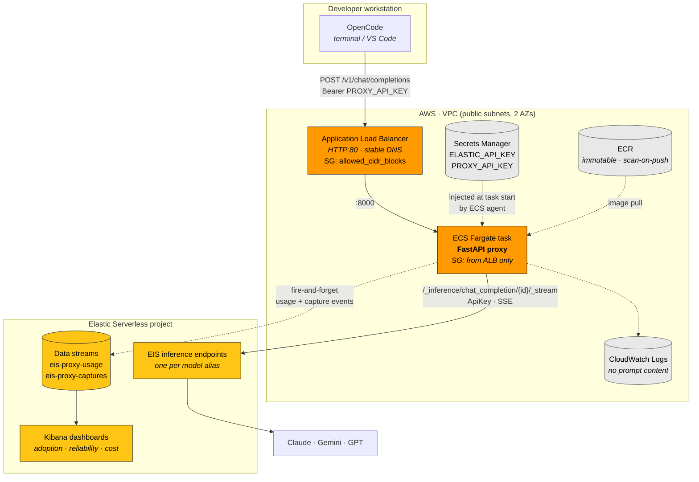

# elastic-reclaim: OpenCode → EIS PoC

Wires a terminal AI coding agent (OpenCode) to Elastic Inference Service
(EIS) through a small FastAPI gateway that translates the OpenAI
chat-completions protocol into Elastic's unified inference API.

> [!WARNING]
> **This is a proof of concept, not a production system.** Two deliberate
> tradeoffs make it unsafe to expose to untrusted networks as-shipped:
>
> - **No TLS.** The ALB serves plaintext HTTP:80, so the bearer token, every
>   prompt, and every model response are readable and replayable by anyone
>   on the network path.
> - **`allowed_cidr_blocks` defaults to `0.0.0.0/0`,** which publishes that
>   plaintext endpoint to the entire internet.
>
> Anything that can reach the proxy can spend your Elastic inference budget.
> Before deploying: restrict `allowed_cidr_blocks` to your own CIDR, and add
> TLS (see [Future enhancements](#2-tls-termination-alb--acm)) before any
> real prompt content crosses it.
>
> Also note `terraform.tfstate` is local and unencrypted, and **contains
> every secret in plaintext** - including the Elastic API key and the proxy
> bearer token. Never commit it, and never commit a `terraform plan` output
> file, which embeds a full copy of that same state.

## Architecture



Request path in one line:

```
OpenCode --(OpenAI /v1/chat/completions + bearer)--> ALB --> ECS Fargate proxy
    --(/_inference/chat_completion/{id}/_stream)--> Elastic Serverless (EIS)
    \--(usage + capture analytics)--> same project --> Kibana dashboards
```

The proxy exposes several models at once (one EIS inference endpoint each),
routes each request by name, and writes per-user/per-model usage analytics
back into the same Elastic project - where three pre-canned Kibana
dashboards visualize adoption, reliability, and (optionally) captured
queries.

## Documentation

| Audience | Guide |
|---|---|
| Platform team (owns Elastic + AWS) | [docs/platform-team.md](docs/platform-team.md) |
| Developers (use the agent) | [docs/developer-onboarding.md](docs/developer-onboarding.md) |
| Reporting a vulnerability / deploying safely | [SECURITY.md](SECURITY.md) |
| Contributing a change | [CONTRIBUTING.md](CONTRIBUTING.md) |
| Release history | [CHANGELOG.md](CHANGELOG.md) |

## File tree

```
elastic-reclaim/
├── terraform/                  # root module - wires the two provider modules together
│   ├── modules/elastic/        # Elastic Serverless project (elastic/ec provider)
│   ├── modules/aws/            # VPC, ALB, security groups, ECR, ECS Fargate (hashicorp/aws)
│   └── modules/sso/            # placeholder: later-phase OIDC design (not wired in)
├── proxy/                      # FastAPI OpenAI-to-EIS gateway (+ usage telemetry)
│   └── app/
├── scripts/                    # deploy.sh, dev-setup.sh
├── docs/                       # platform-team.md, developer-onboarding.md
└── opencode/                   # static OpenCode config template (dev-setup.sh generates the real one)
```
Terraform is split into `modules/aws/` and `modules/elastic/` so a future
provider (`modules/azure/`, `modules/gcp/`) can be added by (1) writing the
module and (2) instantiating it in [terraform/main.tf](terraform/main.tf) -
no changes needed to the existing modules.

## Prerequisites

- Terraform >= 1.6 (built and validated against 1.16.0)
- An AWS account/credentials (`aws configure` or equivalent env vars)
- An Elastic Cloud account with an API key that can create Serverless
  projects (generate one at https://cloud.elastic.co/account/keys)
- Docker, for building the proxy image
- [OpenCode](https://opencode.ai) CLI

Dependency versions (Terraform providers, Python packages, base image) are
pinned to their latest stable releases as of 2026-08-31 - see
[terraform/versions.tf](terraform/versions.tf) and
[proxy/requirements.txt](proxy/requirements.txt).

## Local development & testing

The proxy has unit tests (protocol translation) and integration tests
(full FastAPI app against a mocked Elastic upstream, no network calls):

```bash
cd proxy
python3 -m venv .venv && source .venv/bin/activate
pip install -r requirements-dev.txt
pytest -q
```

To sanity-check the container without touching AWS/Elastic:

```bash
docker build -t eis-proxy-poc:dev .
docker run --rm -p 8000:8000 \
  -e ELASTIC_API_KEY=test-key \
  -e EIS_ENDPOINT_URL=https://example-project.es.example.com \
  -e EIS_MODEL_MAP='{"claude":"test-chat-claude","gemini":"test-chat-gemini","gpt":"test-chat-gpt"}' \
  -e PROXY_API_KEY=local-dev-token \
  eis-proxy-poc:dev
curl http://localhost:8000/health
curl -H "Authorization: Bearer local-dev-token" http://localhost:8000/v1/models
```

Before applying real infrastructure changes, run `terraform fmt -recursive`
and `terraform validate` from `terraform/`.

## Quickstart (platform team)

```bash
cd terraform && cp terraform.tfvars.example terraform.tfvars
# fill in ec_api_key + ec_organization_id, then:
terraform init && terraform apply
cd .. && scripts/deploy.sh          # build, push, roll ECS, smoke test
scripts/dev-setup.sh <username>     # per-developer config bundle
```

The bundle contains an `eis-proxy.env` the developer must `source` in every
shell that runs OpenCode (the script prints the exact command, including a
line to append to `~/.zshrc`). Skipping it is the most common setup failure -
see [developer-onboarding.md](docs/developer-onboarding.md) step 3.

Full operational detail (model catalog, dashboards, capture toggle, token
rotation, costs, teardown): [docs/platform-team.md](docs/platform-team.md).

## Selecting models

The proxy exposes multiple models and routes each request by name, so you
can swap models from inside OpenCode exactly like Claude Code's model
picker - no redeploy needed to switch models, only to add/remove one:

- **In OpenCode**: run `/models`, or press `Ctrl+X` then `M`, or cycle with
  `F2`. The choices come straight from `opencode/opencode.json`'s
  `provider.eis-proxy.models` map.
- **Under the hood**: Terraform's `eis_models` variable
  (`terraform/variables.tf`, default below) creates one EIS inference
  endpoint per entry and passes the whole alias→endpoint map to the proxy as
  `EIS_MODEL_MAP`. The proxy looks up the incoming request's `model` field
  in that map to decide which EIS endpoint to call
  ([proxy/app/main.py](proxy/app/main.py)) - the alias itself is never sent
  to Elastic, since the endpoint it resolves to already pins an exact model.

  ```hcl
  eis_models = {
    claude = "anthropic-claude-5-sonnet"
    gemini = "google-gemini-3.1-pro"
    gpt    = "openai-gpt-5.4"
  }
  ```

**To add, remove, or swap a model**: pick any `model_id` from the
[EIS supported models list](https://www.elastic.co/docs/explore-analyze/elastic-inference/eis-supported-models),
add/edit/remove an entry in `eis_models` (in `terraform.tfvars` or
`terraform/variables.tf`), run `terraform apply`, then add/edit/remove the
matching key under `provider.eis-proxy.models` in `opencode/opencode.json`
(the key must match the `eis_models` alias exactly - that's the only wiring
between the two). No proxy code changes needed either way.

## How the proxy translates the protocol

Elastic's unified `chat_completion` streaming API already mirrors the OpenAI
chunk shape (`object: "chat.completion.chunk"`, `choices[].delta.content`),
but wraps each event under a `chat_completion` key and frames it as SSE with
an `event: message` line:

```
event: message
data: {"chat_completion": {"id": "...", "choices": [...], "object": "chat.completion.chunk"}}
...
event: message
data: [DONE]
```

[proxy/app/translator.py](proxy/app/translator.py) unwraps `chat_completion`
so what reaches OpenCode is a standard OpenAI-compatible SSE stream. See
[proxy/app/main.py](proxy/app/main.py) for the request/response plumbing.

## Protocol compatibility notes

Elastic's unified inference API is close to OpenAI's chat-completions
protocol but not identical, and the gaps only appear with a real agent
client - hand-written `curl` payloads carry none of the vendor extensions
that break it. Three incompatibilities are handled in
[proxy/app/translator.py](proxy/app/translator.py); if you point a different
client at this proxy and see parse errors, this is the first place to look.

**1. Elastic rejects unknown fields in `messages` (request side).**
`UnifiedCompletionRequest` parses strictly and fails the entire request if a
message carries a field it doesn't recognise, reporting only
`failed to parse field [messages]`. OpenCode attaches Anthropic's
`cache_control` to the system message, which is enough to break every
request. The proxy allowlists exactly what Elastic documents
(`Message`: `content`, `role`, `tool_call_id`, `tool_calls`, `reasoning`,
`reasoning_details`; `ContentObject`: `type`, `text`, `image_url`, `file`).

**2. Elastic rejects `index` inside `tool_calls` (request side).**
The Vercel AI SDK preserves `index` from streamed tool-call deltas when it
replays assistant messages. Elastic's `ToolCall` is `{id, type, function}`
only, so that single extra key failed every agentic turn while plain chat
kept working. Sanitizing recurses into `tool_calls` and the nested
`function` object.

**3. EIS emits filler tool-call deltas that strict clients reject (response
side).** Some models (seen with `openai-gpt-5.4`) stream
`{"index": 0, "type": null}` - no `function` object. OpenCode validates
responses and rejected the turn with
`expected object, received undefined`. The proxy drops null-valued keys and
discards deltas carrying nothing but `index`.

Note the deliberate asymmetry in how `index` is treated: **stripped going
up** (Elastic rejects it) but **preserved coming down** (clients need it to
correlate streamed argument fragments). They are different schemas that
happen to share a field name.

When an upstream 4xx occurs, the proxy logs the rejected request's *shape* -
roles and field names, never message content - because Elastic's error names
only the field, not the offending key. That log line is what located both
request-side bugs; prompts deliberately stay out of the logs.

## Security model

Threat model in one line: the proxy holds a live Elastic API key and bills
real inference, so anything that can reach it can spend money.

- **Inbound auth is mandatory.** Every `/v1/*` route requires
  `Authorization: Bearer <PROXY_API_KEY>`, compared with `secrets.compare_digest`
  to avoid timing leaks. The token is generated by Terraform
  (`random_password`, 48 chars), never hand-written. The proxy **refuses to
  start** if auth is enabled and no token is set - there is no way to end up
  unauthenticated by omission. `ALLOW_UNAUTHENTICATED=true` exists for local
  development and must be set explicitly.
- **Secrets never enter the task definition.** `ELASTIC_API_KEY` and
  `PROXY_API_KEY` go to Secrets Manager and are referenced via the container
  `secrets` block, so `ecs:DescribeTaskDefinition` (a common read-only grant)
  no longer exposes them. Only the execution role can read them, and only
  those two ARNs.
- **Least privilege upstream.** The Elasticsearch key Terraform mints holds
  `monitor_inference` at the cluster level - it can run inference but cannot
  create, modify, or delete inference endpoints, read indices, or manage the
  cluster - plus `create_doc`/`create_index`/`auto_configure` on
  `eis-proxy-usage*` and `eis-proxy-captures*` only, so it can append its own
  analytics but cannot read, update, or delete any document.
- **Fail closed, not open.** Upstream errors are detected before any bytes
  are committed to the client, so a revoked Elastic key surfaces as a `502`
  rather than an empty but successful stream. Upstream `401/403` is
  deliberately *not* relayed verbatim: to an OpenAI-compatible client that
  would read as "your token is bad" when the real fault is the proxy's own
  credential.
- **Minimal disclosure.** `/health` is unauthenticated and returns only
  `{"status":"ok"}` - no endpoint URL, no model list. Model aliases are
  behind auth. Upstream error text is truncated before it reaches clients
  or logs.
- **Request limits.** Bodies over `MAX_REQUEST_BYTES` (10 MiB default) are
  rejected with `413`.
- **Supply chain.** ECR is immutable with scan-on-push; CI runs `pip-audit`,
  Trivy against both the Terraform config and the built image, and gitleaks
  over full history.

- **Network path.** Clients reach an ALB (stable DNS, HTTP:80, ingress from
  `allowed_cidr_blocks`); the tasks' port 8000 accepts traffic only from the
  ALB's security group - no longer directly internet-reachable, even though
  tasks keep public IPs for ECR pulls.
- **Usage analytics privacy.** Usage events are metadata only (user, model,
  tokens, latency) - never prompt content. Content capture is a separate,
  default-off Terraform toggle with 30-day retention; developer docs
  disclose both.

Accepted PoC tradeoffs, chosen deliberately and **not** safe for production:
plaintext HTTP (no TLS - the bearer token and prompts are readable by an
on-path observer) and honor-system user attribution (self-reported
X-EIS-User header until SSO). See "Future enhancements" below.

## Future enhancements (deliberately deferred)

These are known, accepted gaps. The PoC's first job is to be broadly
applicable and functional end-to-end; both items below are tracked here so
they are chosen rather than forgotten, and neither blocks a working demo.

### 1. Remote Terraform state (S3 backend)

**Today:** state is local (`terraform/terraform.tfstate`), unencrypted, and
gitignored. It contains the Elastic API key, the generated proxy bearer
token, and the Serverless project password.

**Why deferred:** a remote backend needs its own bootstrapped S3 bucket and
lock table, which is infrastructure-to-manage-the-infrastructure and adds a
chicken-and-egg step to a PoC that currently stands up from nothing with one
`terraform apply`. Local state is fine while a single person iterates on a
single machine.

**When to fix:** before a second person or machine touches this, before it
runs in CI, or before it manages anything long-lived. Without locking, two
concurrent applies can corrupt state or duplicate the Serverless project.

**Shape of the fix** - add to [terraform/versions.tf](terraform/versions.tf)
and re-run `terraform init -migrate-state`:

```hcl
terraform {
  backend "s3" {
    bucket       = "<your-tf-state-bucket>"
    key          = "elastic-reclaim/terraform.tfstate"
    region       = "us-east-1"
    encrypt      = true
    use_lockfile = true # S3-native locking; no DynamoDB table needed
  }
}
```

Until then, treat `terraform.tfstate` as a secret: don't copy it around,
and remember it lands in laptop backups and sync clients.

The same applies to **plan files**. `terraform plan -out=tfplan` writes a
zip that embeds a complete copy of state, with every sensitive value in
plaintext - a `sensitive = true` marking suppresses CLI output, not
on-disk storage. `.gitignore` covers `tfplan`, `*.tfplan`, and
`terraform/*.tfplan`; note that the last pattern alone does **not** match a
bare file named `tfplan`, which is the conventional `-out` target.

### 2. TLS termination (ALB + ACM)

**Today:** the ALB serves plaintext HTTP on port 80. The bearer token, every
prompt, and every model response cross the network in the clear.

**Why deferred:** an ALB needs a registered domain and an ACM certificate to
be worth anything - a self-signed cert would just train users to click
through warnings. That is a real prerequisite, not a five-minute add, and it
doesn't change whether the OpenCode→EIS path works.

**When to fix:** before this carries any real prompt content, before it is
used over untrusted networks (café wifi, hotel, shared office), and
certainly before anyone other than you holds the bearer token. The token
authenticates callers but does nothing to keep an on-path observer from
reading or replaying it.

**Shape of the fix:** the ALB, target group, and tightened task security
group already exist (terraform/modules/aws/alb.tf) - what remains is an
`aws_acm_certificate` for a real domain plus an HTTPS:443 listener, then
retiring the HTTP:80 listener. SSO (terraform/modules/sso) attaches to that
HTTPS listener, so TLS unblocks it too.

## Production considerations (out of scope for this PoC)

- **Access control**: `allowed_cidr_blocks` defaults to `0.0.0.0/0` (at the
  ALB). Restrict it, and land SSO (see terraform/modules/sso), before
  pointing this at production credentials.
- **The `ec_elasticsearch_project` resource is in technical preview** in the
  `elastic/ec` provider - re-check the schema before upgrading the provider
  version pin in [terraform/versions.tf](terraform/versions.tf).
- **Bootstrap credential fragility**: the `elasticstack_elasticsearch_inference_endpoint`
  and `elasticstack_elasticsearch_security_api_key` resources in
  [modules/elastic/main.tf](terraform/modules/elastic/main.tf) authenticate
  using `ec_elasticsearch_project.this.credentials` (username/password),
  which the `ec` provider only populates in the project's *create* response -
  it isn't reissued on refresh or import. This is fine for the normal
  create-once lifecycle Terraform manages here, but if you ever `terraform
  import` this project instead of creating it fresh, these two resources
  will have no way to authenticate and will need a different credential
  source (e.g. a manually-issued API key passed in as a variable).

## License

Licensed under the Apache License, Version 2.0. See [LICENSE](LICENSE).

This project is not affiliated with or endorsed by Elastic N.V. "Elastic",
"Elasticsearch", and "Kibana" are trademarks of Elastic N.V.
